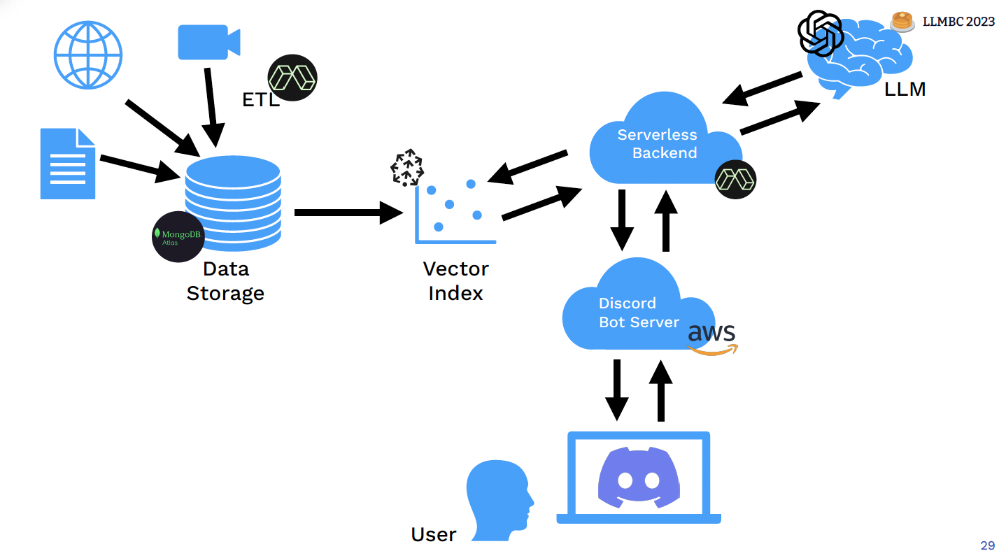

## 목차
1. Introduction
2. Prototyping & Iteration
3. Deploying an MVP
4. Next Steps

## 요약
1965년 Hebert A. simon이 발표한 heuristic problem solving by computer 논문에서도 보이듯이 컴퓨터가 체스를 두고, 기하학 이론을 증명하고, 학교 시험을 통과하고, 투자를 모방하는 행위들을 할 수도 있다는 것은 과거부터 생각했던 것 같다. 하지만 지금은 LLM 하나로 다 할 수 있다는 점이 다르다. 그동안 1975, 1990년에 두번의 AI winter가 있었다. 왜냐면 사람들의 높은 기대를 충족시키는 product를 만들지 못했다. 다시 AI winter를 맞지 않기 위해서는 사람들에게 가치를 주는 제품을 만드는게 중요하다. 아직까지 실제 기업에서 제공하는 리서치 데모와 실제 제품 사이의 갭이 큰 경우도 있지만 foundation 모델의 등장으로 많은 어플리케이션이 만들어지고 있으니, 프롬프트를 잘 tinkering 하거나 open source framework 를 잘 이용해보자. 최종적으로 아래 시스템을 구현해볼 것이다.

## 전체 목차
1. LLM Foundations
    - speed run core ideas in ML
    - learn the core concept behind in transformer architecture
    - get a tour of notable LLM, their training data, and abilities
2. Prompt Engineering
    - prompt techniques for language modeling, instruction, and agent simulation
    - arcana and curiosities from the world of prompt wizardry
3. Augmented Language models
    - moving beyond pure language modeling with tools and retrieval
    - choosing between vector stores/indices(FAISS, Pinecone, Weaviate, Vespa) for long term memory
4. UX for LUIs
    - principles of successful ux design
    - emerging LUI design patterns
    - case studies on the best AI-powered apps today
5. LLMOps: deployment and learning in production
    - how vendors like openai, anthrophic, and cohere compare with each other with open-weight options like T5, Pythia, and Llama
    - how to manage prompt and programs, monitor models, trace chains, and record feedback
6. what's next?
    - what are the limits of scale, large, and small?
    - has multimodality unlocked general purpose robotics?
    - is AGI already here?
    - can we make it safe?
