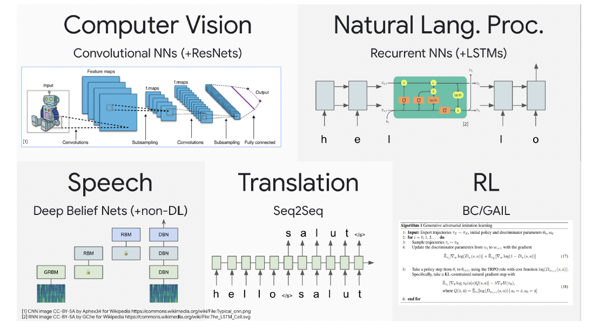
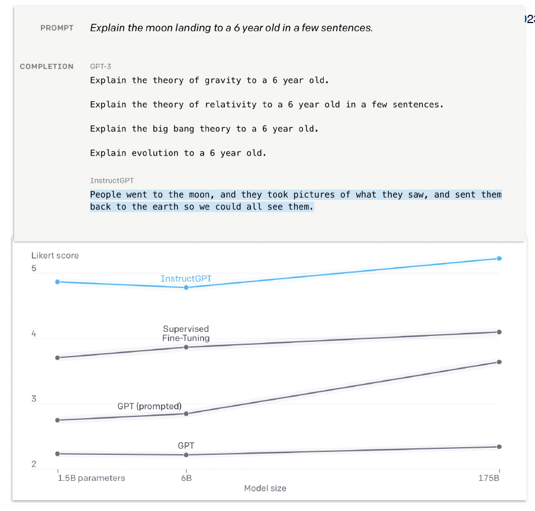

## 목차
1. Foundations of ML
2. Transformer architecture
3. Notable LLMs
4. Training & inference

## Foundation of ML
Software 1.0은 우리가 로직을 작성한 후에 input을 주고 output을 받는 구조였다면 software 2.0은 우리가 로직을 작성하지 않고 데이터로부터 컴퓨터가 학습을 한 후 input을 주고 output을 받는 구조다. 로직을 우리가 직접 짜느냐, 데이터로부터 학습을 하느냐의 차이가 있다. 이 때 당연하지만 중요한 사실이 input과 output은 모두 number 라는 점이다. 이미지, 텍스트 모두 number로 이루어져있다.

Perceptron은 여러개의 input이 들어오고 들어와 가중치가 곱해지고 weighted sum을 구한 후 activation function을 거치면서 하나의 number로 계산된다. Perceptron의 가중치는 vector다. 그리고 layer의 가중치는 matrix다. 여러 input이 여러개의 node로 이루어진 hidden layer를 통과한다. 그리고 NN은 layer의 집합이고 다른 말로 matrix의 집합이다.

**2020년 이전에는 computer vision, speech, translation, NLP, RL 등 각각의 task에서 각각의 NN 아키텍처가 사용되었다면 이후에는 transformer로 거의 통일되었다고 봐도 무방하다.** 그래서 transformer의 이해는 매우 중요하다.

Andrej karpathy가 말하길 트랜스포머가 중요한 nn 아키텍처인 이유는 general-purpose differentiable computer라는 것인데 이것을 다르게 말하면 아래 3가지로 말할 수 있다.
1. expressive (in the forward pass)
2. optimiable (via backpropagation + gradient descent)
3. efficient (high parallelism compute graph)

## Transformer
Transformer를 이해해보자.

_**Resources**_
- [Lucas Beyer's Lecture on Transformers](https://docs.google.com/presentation/d/1ZXFIhYczos679r70Yu8vV9uO6B1J0ztzeDxbnBxD1S0/edit#slide=id.g13dd67c5ab8_0_3938)
- [Peter Bloem's "Transformers from Scratch"](https://peterbloem.nl/blog/transformers)
- [Nelson Elhage's "Transformers for Software Engineers" for a
different view](https://blog.nelhage.com/post/transformers-for-software-engineers/)
- [Andrej Karpathy's entire Neural Networks: Zero to Hero video series](https://karpathy.ai/zero-to-hero.html)
- [Lillian Weng's "The Transformer Family v2" megapost](https://lilianweng.github.io/posts/2023-01-27-the-transformer-family-v2/)

## Notable LLM
### Bert(2019)
- Bidirectional Encoder Representations from Transformer
- Encoder only architecture
- 110M params
- 15% of all words masked out

### T5(2020)
- Encode-decoder architecture
- 11B params
- fine-tuning 하기에는 아직도 여전히 좋다
- unsupervised pretraining 으로 학습함
  - [Colossal Clean Crawled Corpus(C4)](https://paperswithcode.com/dataset/c4) 데이터 셋으로 pretraining을 했다. 이 데이터셋은 Common Crawl 데이터셋에서 cleaning/filtering을 거쳐 만든 데이터셋이다.
  - 이 데이터셋은 50TB의 압축된 데이터 그리고 10B+ 의 웹페이지가 있음
  - 물론 필터해서 대략 800GB, 대략 160B 토큰이 남음
- 데이터 전처리
  - 5문장보다 적은 페이지 삭제, 최소 3단어 이상 있어야 문장으로 인정
  - Dirty, Naughty, Obscene 그리고 다른 나쁜 말들 삭제
  - curly bracket({, }) 이렇게 들어간 것들 전부 삭제
  - 데이터 셋에서 어떤 3문장들 뽑았을 때 두개 이상 겹치는 문장이 있다면 하나 빼고 전부 삭제
- academic supervised task도 함께 진행함
- 데이터셋 관련해서 [CS324(large language models)](https://stanford-cs324.github.io/winter2022/lectures/data/) 자료를 참고하자.

### GPT / GPT-2(2019)
- Generative Pretrained Transformer
- Decoder-only(uses masked self attention) architecture
- gpt가 110M params로 bert base모델과 동일하고 gpt2 중 가장 작은게 117M 정도로 gpt와 사이즈가 비슷하지만 가장 큰 것이 1.5B 정도 된다.
- 학습 데이터
  - Common Crawl 데이터셋에 데이터 퀄리티 이슈가 있었어서 WebText 데이터 셋을 만듦
    - reddit에서 3 karma 이상을 받은 outbound link를 45M개 수집
    - deduplicate하고 heuristic 한 filtering을 거쳐 40GB 텍스트와 8M document이 남음
    - T5에서 사용된 데이터 셋의 20분의 1 정도됨
- Byte pair encoding으로 tokenize 진행
  - 영어를 기준으로 rough하게 4 char가 1 토큰이고 또 3/4 words가 1 토큰이 됨

### GPT-3(2020)
- 175B params (gpt-2와 비교했을 때 x100 가까이커짐)
- 학습 데이터
  - 데이터 셋을 모은건 500B 토큰이지만 300B 토큰으로 학습
  - webtext from reddit(huffpost news, twitter discussion, the guardian news, ...)
  - C4(google patents papers, new york times news, PLoS papers, + 90.9M more domains)
  - wikipedia
  - books(smashwords, Libgen, ...)
  - ...

### GPT-4(2023)
- 대장 등장

>  그럼 그냥 모델 사이즈만 늘리면 다 되는건가? No. 학습만 하고 추론을 못하는 상황이 벌어질 수 있으니 성능은 유지하고 사이즈를 줄일 수 있는 방법을 찾아보자.

> 이렇게 많은 모델 파라미터가 전부 학습을 잘하고 있는걸까? 또 model size와 dataset size에는 어떤 relationship이 있진 않을까? 그래서 나온게 아래 연구

### Chinchilla(2022)
- 이전에는 학습 성능만을 중요시하여 모델 사이즈를 계속해서 늘렸으나, inference에 너무 많은 cost가 들어 서비스에는 적용할 수 없는 상태가 된 것.
- 그래서 딥마인드에서 모델 사이즈와 그에 따라 적절한 학습 데이터 셋 크기 사이에 최적의 관계를 실험적으로 알아냈다. 이 때 사용된 데이터 셋는 고품질이란 가정이 있긴하다.
- 그래서 fixed한 compute budget에서 모델 성능을 유지할 수 있는 방법을 찾아보기 시작한 것.
- Empirically하게 fixed한 compute budget에서 모델 사이즈는 더 줄이고 학습 데이터 셋 크기는 늘리는 방법을 찾아내고 그 연구 결과가 chinchilla이다.
- 이 때 대부분의 LLM들이 undertrained 되었다는걸 알게된다.
- 70B Chinchilla와 280B Gopher를 비교했을 때 같은 compute budget에서 4배 더 적은 params로 4배 더 많은 dataset을 학습시킴.

### Llama(2023)
- 위 딥마인드 논문을 기반으로 Meta에서 실험을 했고 사이즈는 7B, 13B, 32B, 65B까지 다양하고 대략 1T 토큰을 학습했다.
- 학습 데이터
  - Custom quailty-filtering of CommonCrawl(823B), Some C4(190B), Github(100B), Wikipedia(25B), Books(25B), Arxiv(33B), stack exchange(27B)
  - 다해서 대략 1.25T 정도됨
  - 
  - T5나 gpt3를 학습할 땐 code를 제거했는데, 최근 모델들은 전부 최대 5% 정도는 포함하고 있다 왜일까?
    - empirically하게 non-code tasks에서 성능이 올라가기 때문
    - 실제로 Apache, BSD, MIT licenses를 가진 공개된 github 코드가 있고 학습 데이터 셋의 4.5% 정도 포함하고 있다.
- 이런 llama 같은 모델이 backbone 모델이 되어 다양하게 사용될 수 있는데 (뒤에서 나오겠지만) 이 llama가 사람의 instruction을 좀 더 잘 이해할 수 있게 self-instruct 방법을 사용하여 instruction 데이터셋을 생성하고 supervised finetuning을 진행하여 일반 사람들의 instruction에 자연스럽게 대답할 수 있도록했다.

- [Yao Fu's How does GPT Obtain its Ability?](https://yaofu.notion.site/How-does-GPT-Obtain-its-Ability-Tracing-Emergent-Abilities-of-Language-Models-to-their-Sources-b9a57ac0fcf74f30a1ab9e3e36fa1dc1#929906a4292b4cceadabd92c47f3843f)를 참고하자.

## Instruction Tuning 기법들
> 지금까지 모델 성능도 올리고, 또 추론을 위해 성능 대비 모델을 제한된 compute resource에서 model size와 train dataset 사이즈도 optimize 한 것도 ok. 근데 사람이 질문을 하는 형태에 맞춰 이해하고 응답하는 성능이 좀 떨어지는 것 같다. 그래서 나온 Instruction Tuning(ex. SFT, RLHF) 기법들에 대해 살펴보자.

### Few shot vs Zero shot
- gpt3(2020) 때만 해도 당연히 few shot을 사용해야지 생각 ex) text completion
- 하지만 chatgpt(2022) 나오고 대부분 zero shot을 하기 시작 ex) instruction-following
- 이렇게 새로운 task를 배울 때 weight 업데이트가 일어나지 않아 in-context learning 이라고 부른다.

### Supervised Fine-tuning(SFT)
- gpt3를 학습한 데이터셋에는 zero shot form 형태가 적게 포함되어있다.
- 그래서 instruction completion을 위한 적은 high quality dataset으로 fine tuning을 진행

### InstructGPT/GPT-3.5 (2022.01)
- fine-tuning을 넘어서 이제는 사람이 gpt3 output에 대해 점수를 매기고 그걸로 강화학습을 진행.
  
  _출처: https://openai.com/research/instruction-following_
- OpenAI API로는 text-davinci-002 모델이 이에 해당
- OpenAI에서 지금까지 했던 alignment research가 처음으로 적용된 product가 instructgpt라고 함.
- 물론 연구는 다른 곳에서도 (ex. [FLAN](chrome-extension://efaidnbmnnnibpcajpcglclefindmkaj/https://jasonwei20.github.io/files/FLAN%20talk%20external.pdf), [TO](https://arxiv.org/abs/2110.08207)) 연구되고 있었음.

### Chatgpt
Further RLHF on conversation. 그래서 chatgpt까지의 역사를 보면 다음과 같다.

### Alignment Tax
이런 Instruction-tuning이 zero-shot ability는 올리나 confidence는 점점 less calibrated 되고 few shot ability도 더 낮아짐. 뭐 이런 연구도 있다.

## Retrieval 모델
> LM이 language를 학습하고 fact를 memorize하는 것이라면 그냥 언어를 params에 넣어 large database를 만들고 fact를 retrieve 할 수는 없을까?

### Retrieval-enhanced Transformer (2021)
BERT-encode sentence는 1T token이 넘는 large DB를 저장하고 matching sentence를 가져오지만, 아직까지 LLM만큼 잘 동작하지 않는다.

참고자료
- [Lillian Weng's "The Transformer Family v2" megapost](https://lilianweng.github.io/posts/2023-01-27-the-transformer-family-v2/)
- [Xavier Amatriain's Transformer Models Catalog](https://arxiv.org/abs/2302.07730)

## LLM을 학습은 당연히 어렵다. 왜?
### Problem with training LLM
- 데이터 자체를 전처리하는 것도 어려움.
- 데이터 셋이 massive

### Parallelism
- 3가지로 분류
  - Data parallelism: spread a single batch of data acress GPU
  - Model parallelism: spread the model's layers across GPUs
    - 모델이 massive -> single gpu에 모델이 들어가지 않음
  - Tensor parallelism: spread a single matrix op across GPUs
- had to use multiple trics "3d parallelism" from great two libraries: [DeepSpeed](https://github.com/microsoft/DeepSpeed), [Megatron-LM](https://github.com/NVIDIA/Megatron-LM)
  - BLOOM(GPT-3 sized LM)의 예시
    
- Sharded Data-Parallelism
  

참고자료: [ZeRO & DeepSpeed: New system optimizations enable training models with over 100 billion parameters](https://www.microsoft.com/en-us/research/blog/zero-deepspeed-new-system-optimizations-enable-training-models-with-over-100-billion-parameters/)

### Training hell
오랜시간을 학습해야함

## LLM 추론에서는 무엇을 고려해야할까?
1. Considerations for LLM inference
    - auto-regressive sampling의 이해
    - runtime complextiy 개선
    - large model size 다루기
2. Auto-regressive sampling
3. Runtime complexity
4. Large model size 다루기

참고자료
- [Megatron-LM (GitHub)](https://github.com/NVIDIA/Megatron-LM): probably still the best insights into training
LLMs at scale.
- [OpenAI post Techniques for Training Large Neural Networks](https://openai.com/research/techniques-for-training-large-neural-networks)
- [Lillian Weng's "Large Transformer Model Inference Optimization"](https://lilianweng.github.io/posts/2023-01-10-inference-optimization/)

## 좀 더 파보자.
- Transformer 아키텍처
- Bert 아키텍처
- GPT 아키텍처
- gpt에 사용된 byte pair encoding
- LLama 아키텍처
- Training and inference optimization in LLM
- LLM overview
  - [A Comprehensive Overview of Large Language Models](https://arxiv.org/abs/2307.06435)
  - [A Survey of Large Language Models](https://arxiv.org/abs/2303.18223)
