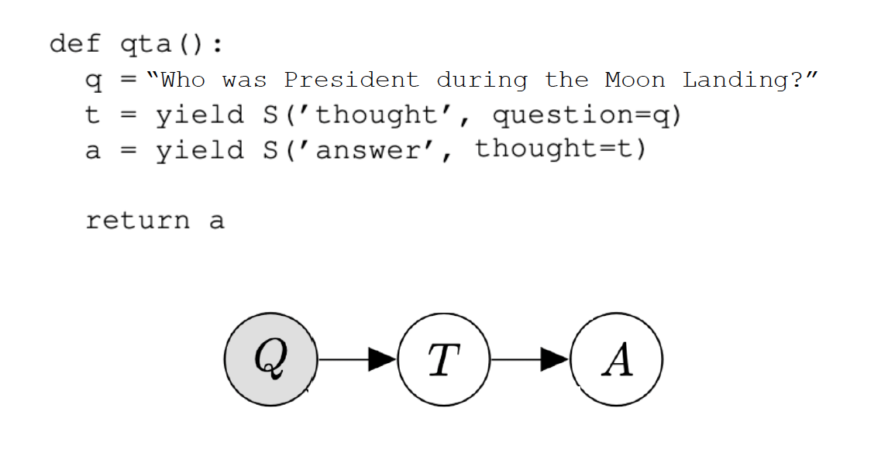
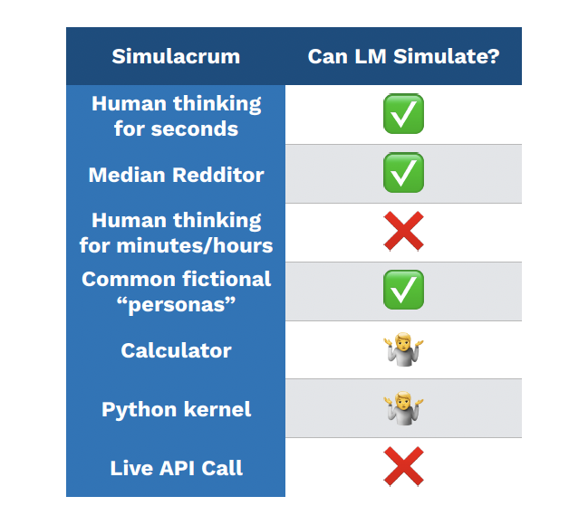
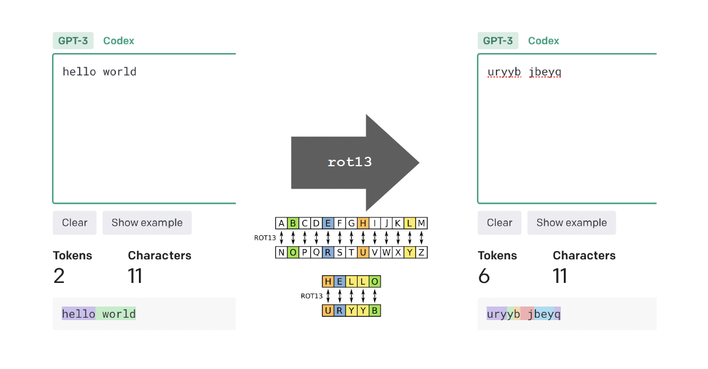
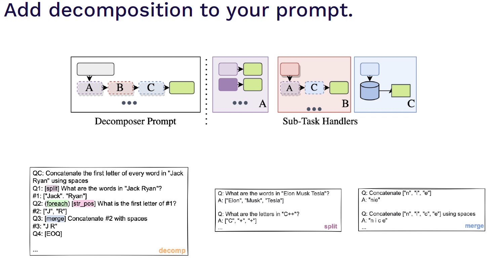
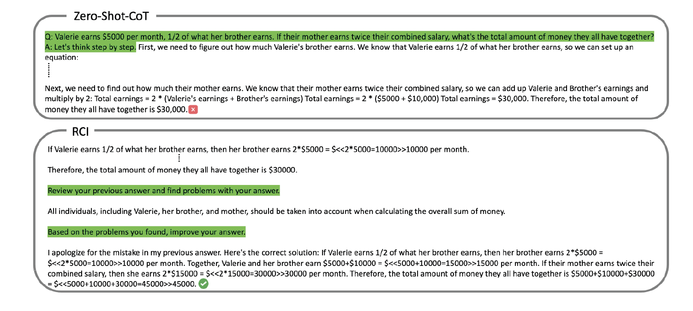
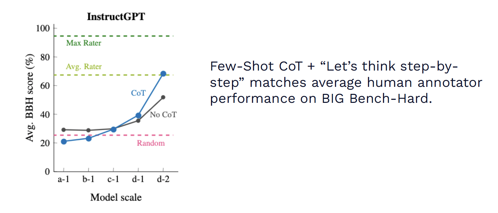
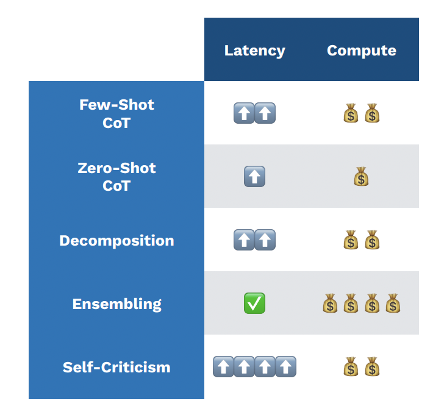

## 목차
1. Prompt are magic spells: high-level intuitions for prompting
2. Prompting Techniques: an emerging playbook for effective prompting

## Prompt are magic spells
- 언어 모델은 텍스트를 보고 다음 단어의 확률을 예측하여 학습되고 random한 가중치로 시작해서 실제 데이터와 유사한 텍스트에 높은 확률을 할당하는 방법을 사용한다.
- 언어 모델을 statistical pattern matcher라고 생각할 수도 있지만 이건 잘못된 직관을 제공할 수도 있다.
- 우리가 알고있는 linear regression과 같은 전통적인 statistical model은 language 모델을 생각할 수 있는 최선의 방법이 아니다.
- 더 나은 직관은 probabilistic program을 생각해보면 좋은데, 이건 random variable을 조작하고 복잡한 statistic을 표현할 수 있다. 또한 probabilistic program은 graphical 모델로 표현할 수 있다.   이 직관에 대한 내용을 더 자세히 알고 싶다면 [Language Model Cascades paper et al.](https://arxiv.org/abs/2207.10342)을 참고해보자.
  

어떤 방식으로 prompting 할 수 있을까? 또 모델은 어떻게 행동할까?
- for pretrained models(ex. gpt-3, llama)
  - a prompt is a portal
    - pretrained model은 대부분 document generator다.
    - 전체 가능한 possible docuement에서 prompt에 해당하는 문서들에 대해 re weight를 하는 과정이다.
- for instruction-tuned models(chatgpt, alpaca)
  - a prompt is a wish
    - Just ask instruction models, but be precise
- for agent simulation(lastest language models)
  - a prompt creates a golem(사람의 형상을 한 움직이는 존재라는 의미)
    - model은 persona를 가질 수도 있다. 사람도 simulation할 수 있는 대상 중 하나.
    - LM이 발전하면 universal simulator 가 될 것.
    - LM이 더 좋아짐에 따라 인터넷에 게시되는 텍스트를 생성하는 모든 프로세스는 결국 시뮬레이션이 필요할 것.
    - 하지만 지금 simluator로써 LLM은 얼마나 좋을까 (2023기준)
      
    - simulator에서 부족한 부분을 real data를 이용해서 해결할 수 있음

## Prompting Techniques
First, the ugly bits
- 케릭터 수준의 작업이 어려웠다. 모델은 입력을 토큰으로 보기 때문에 rotating하거나 reversing하는데 어려움을 겪는다. 근데 gpt-4에서는 해결된 듯.
  

어떤 prompt 테크닉들이 있을까?
1. structured text
    - language model은 formatted text에서 더 잘 동작한다. 그래서 pseudocode가 결과를 향상 시킬 수 있다.
2. decomposition and reasoning
    - (Khot et al., “Decomposed Prompting” - https://arxiv.org/abs/2210.02406)
    
    - reasoning by few-shot prompting with CoT
    - reasoning by "just asking for it"
      - Let's think step-by-step과 같은 프롬프트를 사용해 reasoning capability를 끌어냄
3. self-criticism
    - "just ask" the model to fix its answer
      
      _[Kim et al., “LMs can Solve Computer Tasks](https://arxiv.org/abs/2303.17491)_
4. ensembling
5. 다양한 프롬프트 스킬을 조합하는게 가장 성능이 좋더라
    - few-shot, chain of thought, ensembling 등 다양한 prompting technique를 조합한다. 
      
      _[Suzgun et al., Challenging BIG-Bench Tasks and Whether CoT Can Solve Them](https://arxiv.org/abs/2210.09261)_
    - 하지만 이 때 latency와 computing cost를 생각할 것.
      

## Do LMs have theory of Mind?
지금 훨씬 더 많고 좋은 prompting 방법들이 나왔으니 참고해보자.

## 좀 더 파보자
- statistical pattern matcher vs probabilistic program
- prompt techniques의 ugly bits들
- 생각해볼만한 글: [Prompt Engineering의 가치](https://www.t4eh0.com/prompt-engineering/)